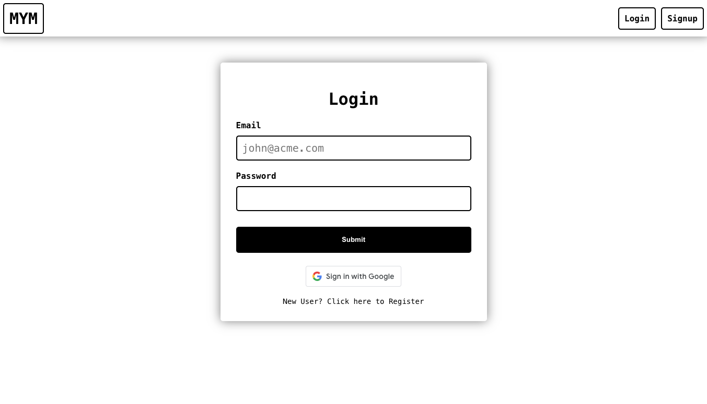
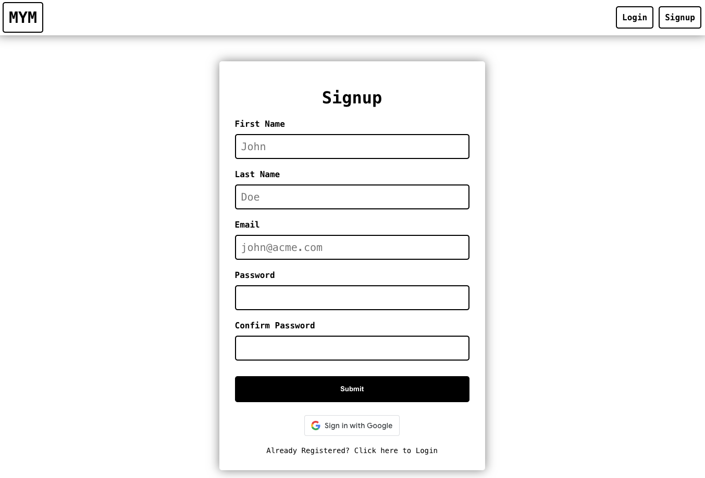
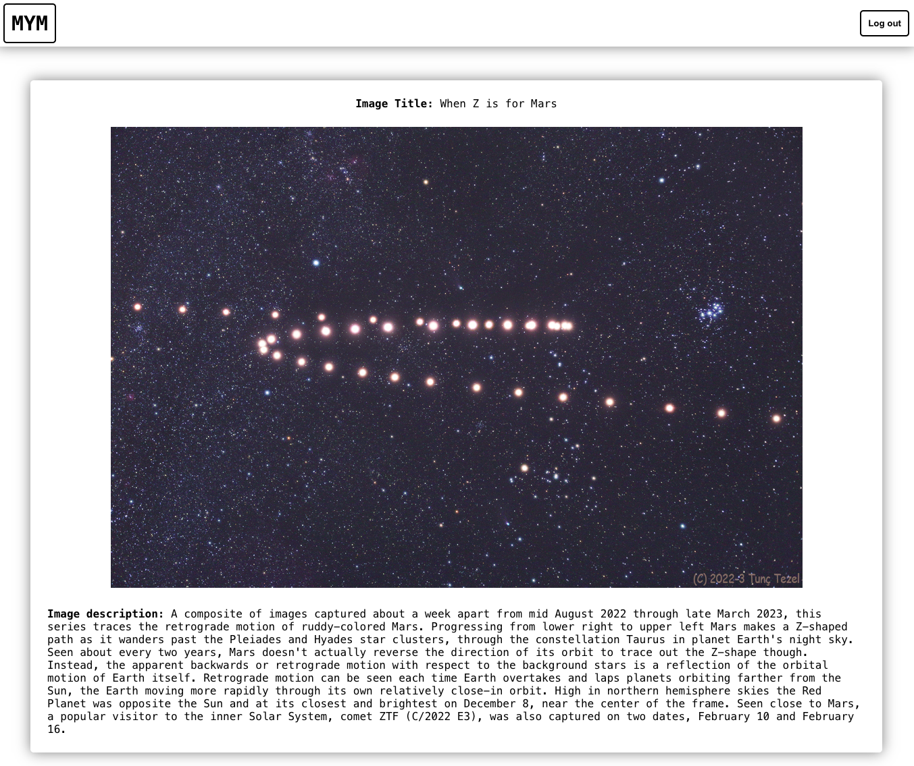

# MYM Project

This project implements an SPA with login, signup, and Google login to access the NASA image of the day upon login. ERC20 token minting Dapp using:

This project uses React, TypeScript, MongoDB, Express, and Docker<br>

The project is deployed on Vercel here: 

The SPA implements the below functionality:

* Allows user to login or signup with email or Google signin.
* Posts each signup to the MongoDB database and returns a JWT which is persisted to local storage.
* Validates each email signin with credentials in MongoDB.
* Maintains user login upon page refresh.
* Protects routes from users not logged in.
* Displays NASA image of the day upon login.
* Allows user to log out and is pushed to login page.

Front-end is located in `./frontend`<br>
Back-end is located in `./backend`<br>

Please add the below environment variables to your .env file inside of `./frontend`

`REACT_APP_GOOGLE_CLIENT_ID`<br>
`REACT_APP_NASA_API_KEY`

Please add the below environment variables to your .env file inside of `./backend`

`JWT_SECRET`<br>
`PORT`

To run the project in Docker run the below command from the root folder:
```shell
docker compose up
```
This will start containers for the front-end, back-end, and api in Docker.

### Front-End View - Login

### Front-End View - Signup

### Front-End View - Logged in

